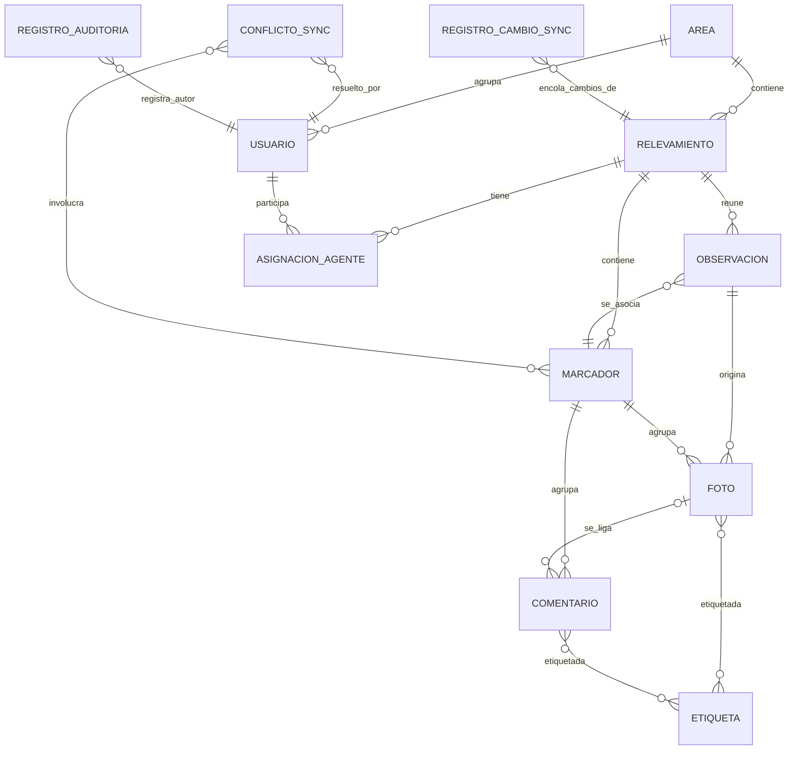

# Modelo conceptual — GeoVial

**Proyecto:** GeoVial
**Documento:** modelo-conceptual_v1.0.md
**Versión:** 1.0
**Estado:** Propuesto
**Fecha:** 2026-06-01
**Autor:** Analista Funcional senior (AG-02), Equipo SDD 2.0

Este modelo conceptual describe las entidades del dominio de GeoVial, sus atributos clave en términos de semántica (sin tipos físicos, que viven en 05), sus relaciones y cardinalidades, las reglas conceptuales que invoca y la trazabilidad a los CU y RN que lo consumen. Respeta el modelo lógico-resumen de PROJECT-README §7: `Relevamiento (1) → (N) Observación`; `Observación (N) → (1) Marcador`; `Marcador (1) → (N) Foto` y `(N) Comentario`; `Foto/Comentario (N) → (N) Etiqueta`; más la cola de cambios de sincronización.

## 1. Entidades

### 1.1 Usuario

Persona que opera el sistema en alguno de los niveles de la jerarquía. Ejemplo de instancia: un jefe de área de la "Zona Norte".

Atributos clave: identificador del usuario, nombre, rol jerárquico (raíz, jefe general, jefe de área, agente de campo), estado de vigencia, indicador de método de seguridad del teléfono configurado.

### 1.2 Área

Ámbito administrativo de vialidad que delimita la autorización sobre relevamientos y agentes. Ejemplo de instancia: el área "Zona Norte".

Atributos clave: identificador del área, nombre, jefe de área responsable.

### 1.3 Relevamiento

Tarea de registrar observaciones sobre el estado de un puente o camino; se estructura como una serie de marcadores y tiene estados. Ejemplo de instancia: el relevamiento "Puente Río 12" en estado revisión.

Atributos clave: identificador del relevamiento, identificación de la obra, estado (recolección, revisión, cerrado), radio de agrupación, área a la que pertenece.

### 1.4 AsignaciónAgente

Vínculo que habilita a un agente de campo a recolectar en un relevamiento. Ejemplo de instancia: el agente "A. Pérez" asignado al relevamiento "Puente Río 12".

Atributos clave: identificador de la asignación, relevamiento asignado, agente asignado, vigencia de la asignación.

### 1.5 Observación

Conjunto de notas y fotos asociadas a un punto geográfico, perteneciente a un relevamiento y asociada a un marcador. Ejemplo de instancia: una observación de fisura sobre el "Puente Río 12".

Atributos clave: identificador de la observación, relevamiento al que pertenece, marcador al que se asocia, agente que la capturó, momento de captura, indicador de sin georreferenciar.

### 1.6 Marcador

Punto en el mapa que agrupa observaciones y es etiquetable; varias observaciones pueden compartir un marcador. Ejemplo de instancia: un marcador sobre una alcantarilla del "Camino 8".

Atributos clave: identificador del marcador, relevamiento al que pertenece, coordenada (posición geográfica), indicador de conflicto.

### 1.7 Foto

Imagen capturada en una observación, con su posición de origen y eventuales metadatos de ubicación. Ejemplo de instancia: una foto de una grieta tomada en terreno.

Atributos clave: identificador de la foto, marcador al que pertenece, observación de origen, indicador de presencia de metadatos de ubicación, fuente de la coordenada (metadatos o manual).

### 1.8 Comentario

Nota textual asociada a un marcador o a una foto. Ejemplo de instancia: "fisura longitudinal de 2 m".

Atributos clave: identificador del comentario, marcador al que pertenece, foto a la que se liga (opcional), autor, momento.

### 1.9 Etiqueta

Marca aplicada a fotos o comentarios para su posterior filtrado. Ejemplo de instancia: la etiqueta "fisura".

Atributos clave: identificador de la etiqueta, nombre.

### 1.10 RegistroCambioSync

Entrada de la cola local que registra cada cambio pendiente de sincronizar. Ejemplo de instancia: el alta de una observación capturada sin conexión.

Atributos clave: identificador único del cambio, tipo de operación (alta, edición), entidad afectada, referencia a la entidad, marca temporal, estado de sincronización.

### 1.11 ConflictoSync

Situación detectada en la que coexisten cambios incompatibles o marcadores dentro de un mismo radio, pendiente de resolución. Ejemplo de instancia: dos marcadores a 9 m en un relevamiento con radio 15 m.

Atributos clave: identificador del conflicto, tipo (marcadores en un mismo radio, edición en conflicto), recursos involucrados, estado de resolución, decisor (jefe de área o usuario raíz).

### 1.12 RegistroAuditoría

Asiento inalterable de un acceso autenticado o de una acción administrativa. Ejemplo de instancia: el alta de un jefe de área por el jefe general.

Atributos clave: identificador del registro, autor, momento, operación, recurso afectado.

## 2. Atributos clave

| Entidad | Atributo | Semántica | Restricción conceptual |
| --- | --- | --- | --- |
| Usuario | rol jerárquico | Nivel del usuario en la jerarquía | Uno de: raíz, jefe general, jefe de área, agente (RC-05) |
| Usuario | método de seguridad configurado | Habilita el modo sin conexión | Requerido para offline (RN-06) |
| Área | jefe de área responsable | Usuario que administra el área | Debe ser un usuario con rol jefe de área |
| Relevamiento | estado | Etapa del ciclo del relevamiento | Uno de: recolección, revisión, cerrado (RC-06) |
| Relevamiento | radio de agrupación | Distancia para agrupar marcadores | Valor admisible positivo (RN-02) |
| AsignaciónAgente | agente asignado | Agente habilitado a recolectar | Debe pertenecer al área del relevamiento (RC-07) |
| Observación | marcador al que se asocia | Punto que agrupa la observación | Integridad referencial a un marcador del mismo relevamiento (RC-02) |
| Observación | indicador de sin georreferenciar | Marca de pendiente de ubicación | Coherente con la fuente de coordenada (RN-03) |
| Marcador | coordenada | Posición geográfica del punto | Identidad de marcador y radio (RC-01) |
| Marcador | indicador de conflicto | Señala conflicto pendiente | Levantado solo por resolución humana (RN-02, RN-04) |
| Foto | fuente de la coordenada | Metadatos o ubicación manual | Prioridad de metadatos (RN-03) |
| Comentario | foto a la que se liga | Vínculo opcional a una foto | Cardinalidad foto/comentario (RC-04) |
| RegistroCambioSync | identificador único del cambio | Clave de idempotencia | Único en la cola (RC-03) |
| ConflictoSync | estado de resolución | Pendiente o resuelto | Resuelto solo por decisión humana (RN-02, RN-04) |
| RegistroAuditoría | momento | Instante del evento | Inalterable durante la retención (RN-07) |

## 3. Relaciones

- Un Área agrupa a varios Usuarios (jefe de área y agentes); cada agente y cada jefe de área pertenece a un Área.
- Un Relevamiento pertenece a un Área y reúne varias Observaciones.
- Una AsignaciónAgente vincula un Relevamiento con un Usuario agente de campo.
- Una Observación pertenece a un Relevamiento y se asocia a un Marcador.
- Un Marcador pertenece a un Relevamiento y agrupa varias Observaciones, varias Fotos y varios Comentarios.
- Una Foto pertenece a un Marcador y se origina en una Observación.
- Un Comentario pertenece a un Marcador y se liga opcionalmente a una Foto.
- Una Etiqueta se aplica a varias Fotos y a varios Comentarios, y una Foto o un Comentario puede tener varias Etiquetas.
- Un RegistroCambioSync refiere a la entidad cuyo cambio encola para sincronizar.
- Un ConflictoSync involucra a los Marcadores u Observaciones en conflicto y lo resuelve un Usuario.
- Un RegistroAuditoría refiere al Usuario autor y al recurso afectado por la acción.

## 4. Cardinalidades

- Área (1) —— (N) Usuario.
- Área (1) —— (N) Relevamiento.
- Relevamiento (1) —— (N) Observación.
- Relevamiento (1) —— (N) AsignaciónAgente; Usuario agente (1) —— (N) AsignaciónAgente.
- Observación (N) —— (1) Marcador.
- Marcador (1) —— (N) Foto.
- Marcador (1) —— (N) Comentario.
- Observación (1) —— (N) Foto.
- Foto (0..1) —— (N) Comentario (un comentario se liga a cero o una foto; una foto puede tener varios comentarios).
- Foto (N) —— (N) Etiqueta; Comentario (N) —— (N) Etiqueta.
- RegistroCambioSync (N) —— (1) entidad referida.
- ConflictoSync (N) —— (N) Marcador u Observación involucrados; ConflictoSync (N) —— (1) Usuario decisor.
- RegistroAuditoría (N) —— (1) Usuario autor.

## 5. Reglas conceptuales

El modelo invoca las siguientes reglas conceptuales, detalladas en `reglas-conceptuales-de-modelo/`:

- RC-01: identidad de marcador y radio de agrupación.
- RC-02: integridad referencial observación → marcador del mismo relevamiento.
- RC-03: unicidad del identificador en la cola de sincronización para idempotencia.
- RC-04: cardinalidad de fotos y comentarios y su etiquetado.
- RC-05: valores permitidos del rol jerárquico del usuario.
- RC-06: valores y transiciones permitidas del estado del relevamiento.
- RC-07: integridad de la asignación de agente al área del relevamiento.

## 6. Glosario

| Término | Definición |
| --- | --- |
| Relevamiento | Tarea de registrar observaciones sobre el estado de un puente o camino, con estados recolección, revisión y cerrado |
| Observación | Conjunto de notas y fotos asociadas a un punto geográfico dentro de un relevamiento |
| Marcador | Punto en el mapa que agrupa observaciones y es etiquetable |
| Foto | Imagen capturada en una observación, con su posición de origen |
| Comentario | Nota textual asociada a un marcador o a una foto |
| Etiqueta | Marca aplicada a fotos o comentarios para su filtrado |
| Usuario | Persona que opera el sistema en un nivel de la jerarquía |
| Área | Ámbito administrativo que delimita la autorización sobre relevamientos y agentes |
| AsignaciónAgente | Vínculo que habilita a un agente a recolectar en un relevamiento |
| Cola de sincronización | Conjunto de RegistroCambioSync pendientes de sincronizar |
| Conflicto de sincronización | Coexistencia de cambios incompatibles o marcadores en un mismo radio, pendiente de resolución |
| Bandeja sin georreferenciar | Agrupación lógica de observaciones de un relevamiento pendientes de ubicación |
| Registro de auditoría | Asiento inalterable de accesos y acciones administrativas |
| Radio de agrupación | Distancia configurable bajo la cual dos marcadores se consideran candidatos al mismo punto |

## 7. Diagrama

## 8. Trazabilidad

| Entidad | CU que la consumen | RN que la restringen |
| --- | --- | --- |
| Usuario | CU-02, CU-03, CU-13, CU-14 | RN-01, RN-06, RN-08 |
| Área | CU-01, CU-03, CU-14 | RN-01 |
| Relevamiento | CU-01, CU-02, CU-08, CU-10, CU-11 | RN-02, RN-05 |
| AsignaciónAgente | CU-01, CU-02 | RN-01 |
| Observación | CU-04, CU-05, CU-06, CU-08 | RN-02, RN-03, RN-05 |
| Marcador | CU-04, CU-05, CU-09, CU-11, CU-12 | RN-02, RN-04 |
| Foto | CU-04, CU-05, CU-09 | RN-03 |
| Comentario | CU-09 | RN-05 |
| Etiqueta | CU-08, CU-09 | RN-05 |
| RegistroCambioSync | CU-06, CU-07 | RN-04 |
| ConflictoSync | CU-07, CU-11, CU-12 | RN-02, RN-04 |
| RegistroAuditoría | CU-13, CU-14 | RN-07, RN-08 |

## 9. Control de cambios

| Versión | Fecha | Cambios |
| --- | --- | --- |
| 1.0 | 2026-06-01 | Modelo conceptual inicial generado por AG-02 a partir de los CU, las RN y el modelo lógico-resumen de PROJECT-README §7 |
