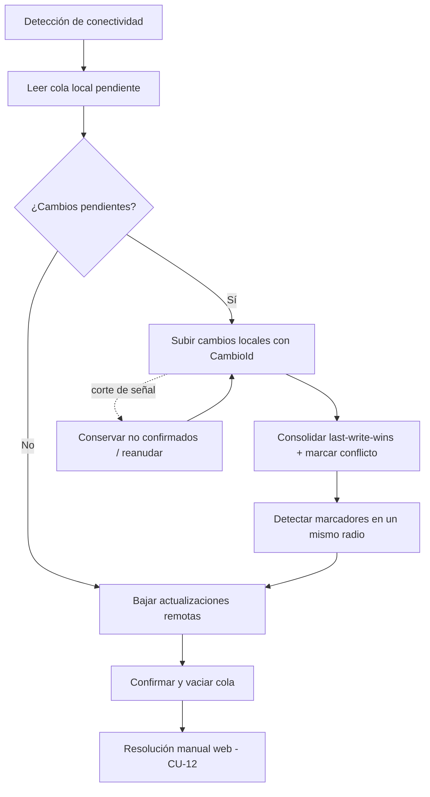
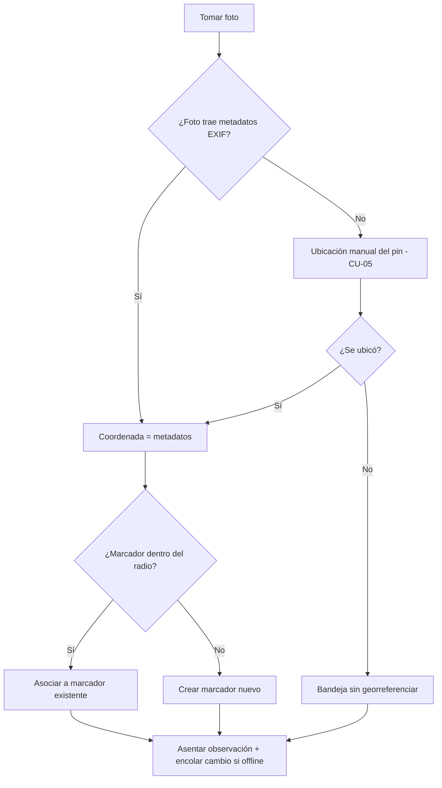

# Flujo de ejecución — GeoVial

**Proyecto:** GeoVial
**Documento:** flujo-ejecucion_v1.0.md
**Versión:** 1.0
**Estado:** Propuesto
**Fecha:** 2026-06-01
**Autor:** Arquitecto de Software Senior (AG-05), Equipo SDD 2.0
**Trazabilidad upstream:** CU-04, CU-05, CU-06, CU-07, CU-11, CU-12; RN-02, RN-03, RN-04; RC-01, RC-02, RC-03; ADR-05, ADR-06, ADR-07

## 1. Objetivo

GeoVial tiene dos orquestaciones no triviales que justifican este documento (web-monolith con orquestación compleja, §2.2): el motor de sincronización offline-first con resolución de conflictos y el flujo de georreferenciación al capturar (metadatos EXIF → manual → bandeja sin georreferenciar). Este documento describe ambos pipelines paso a paso, con sus transformaciones de datos, puntos de retorno y errores.

## 2. Pipeline de sincronización offline-first

Materializa CU-06 (captura local) y CU-07 (sincronizar). Disparado automáticamente al detectar conexión recuperada (NFR de detección de conectividad). Ejecutado por `GeoVial.Sync` (ADR-07) contra la API REST del backend (ADR-02).

### 2.1 Etapas

1. **Detección de conectividad.** La app detecta que el dispositivo recuperó señal y notifica que hay cambios pendientes. Entrada: estado de red. Salida: disparo del pipeline.
2. **Lectura de la cola local.** Se leen los RegistroCambioSync con `EstadoSincronizacion = pendiente`, ordenados por MarcaTemporal. Entrada: tabla SQLite (modelo lógico §1.13). Salida: lote de cambios a subir.
3. **Subida de cambios locales.** Cada cambio se envía al backend con su CambioId y su MarcaTemporal. El backend valida idempotencia: si el CambioId ya se aplicó (RC-03), lo omite sin duplicar. Transformación: RegistroCambioSync → comando de aplicación sobre el estado central.
4. **Consolidación last-write-wins.** Por cada cambio, el backend consolida contra el estado central; ante choque de campo prevalece la marca temporal más reciente (RN-04) y el recurso afectado queda con `EnConflicto = 1`. Salida: estado central actualizado + marcas de conflicto. Error: `CONSOLIDACION_INVALIDA` (aborta el cambio, lo conserva en la cola); `CONFLICTO_NO_MARCADO` (no considera sincronizado el recurso hasta marcarlo).
5. **Detección de marcadores en un mismo radio.** El backend compara las coordenadas de los marcadores del relevamiento contra el radio de agrupación (RC-01, RN-02); los que distan menos que el radio generan un ConflictoSync de tipo "marcadores en un mismo radio" (`MARCADORES_EN_RADIO`), sin unificarlos.
6. **Bajada de actualizaciones.** El backend devuelve las últimas actualizaciones de los relevamientos asignados al agente; la app las aplica a su estado local. Transformación: estado central → estado local.
7. **Confirmación y vaciado de cola.** Los cambios subidos con éxito se marcan `confirmado` y se retiran de la cola. Salida: cola vacía de lo sincronizado, resultado confirmado.

### 2.2 Flujos alternativos

- **Sincronización parcial por interrupción.** Si la conexión se corta a mitad de la subida (`SINCRONIZACION_INTERRUMPIDA`), los cambios no confirmados permanecen en la cola; al recuperar señal el pipeline reanuda desde la etapa 3 sin duplicar los ya confirmados (idempotencia por CambioId). Punto de retorno: etapa 3.
- **Sin cambios pendientes.** Si la cola está vacía, el pipeline salta a la etapa 6 (solo baja actualizaciones). Punto de retorno: etapa 6.

### 2.3 Resolución manual posterior (web)

Las marcas de conflicto (etapas 4 y 5) quedan pendientes hasta que un jefe de área las resuelve desde la web (CU-12): unifica o separa marcadores (RN-02), dirime ediciones (RN-04), el sistema levanta `EnConflicto`, deja la base consistente y audita la resolución (RN-07, ADR-14). La detección y el listado de pendientes es CU-11. Concurrencia: si dos usuarios resuelven el mismo conflicto, prevalece la primera resolución y la segunda recibe `CONFLICTO_INEXISTENTE`.

### 2.4 Diagrama

## 3. Flujo de georreferenciación al capturar

Materializa CU-04 (captura con georreferenciación automática) y CU-05 (ubicación manual). Aplica la prioridad de fuentes de RN-03.

### 3.1 Etapas

1. **Captura de la foto.** El agente toma una foto en el punto de la obra. Entrada: foto. Precondición: relevamiento en estado recolección (RN-05).
2. **Resolución de la coordenada — fuente primaria EXIF.** El sistema lee los metadatos de ubicación de la foto. Si existen, `FuenteCoordenada = metadatos` y la coordenada queda resuelta (RN-03). Salida: coordenada.
3. **Asociación o creación de marcador por radio.** Con la coordenada resuelta, el sistema busca un marcador del relevamiento dentro del radio de agrupación (RC-01, RN-02). Si existe, asocia la observación a ese marcador; si no, crea un marcador nuevo en esa coordenada. Transformación: coordenada → MarcadorId.
4. **Fuente secundaria — ubicación manual.** Si la foto no trae metadatos (`OBSERVACION_SIN_GEORREFERENCIA`), el flujo deriva a CU-05: el agente ubica el punto con el pin sobre el mapa (Leaflet, ADR-04); `FuenteCoordenada = manual`. Vuelve a la etapa 3 con la coordenada manual.
5. **Fuente terciaria — bandeja sin georreferenciar.** Si tampoco se ubica manualmente, la observación queda con `SinGeorreferenciar = 1` y `MarcadorId = NULL`, asentada en la bandeja sin georreferenciar del relevamiento (RC-02).
6. **Asiento de la observación.** El sistema asienta la observación, su foto, comentarios y etiquetas. En captura offline (CU-06), todo se persiste en SQLite y se encola un RegistroCambioSync (etapa 2 del pipeline de §2).

### 3.2 Errores

| Código | Causa | Resultado |
| --- | --- | --- |
| `OBSERVACION_SIN_GEORREFERENCIA` | La foto no trae metadatos de ubicación (RN-03) | Deriva a ubicación manual (CU-05) o a la bandeja sin georreferenciar |
| `RELEVAMIENTO_SOLO_LECTURA` | Captura sobre un relevamiento cerrado (RN-05) | Rechaza la captura |
| `ACCESO_NO_AUTORIZADO` | El agente no está asignado o no pertenece al área (RN-01) | Rechaza y registra el intento |

### 3.3 Diagrama

## 4. Trazabilidad

| Pipeline | CU | RN | RC | ADR |
| --- | --- | --- | --- | --- |
| Sincronización offline-first | CU-06, CU-07, CU-11, CU-12 | RN-02, RN-04 | RC-01, RC-03 | ADR-05, ADR-06, ADR-07 |
| Georreferenciación al capturar | CU-04, CU-05 | RN-02, RN-03, RN-05 | RC-01, RC-02 | ADR-04 |

## 5. Control de cambios

| Versión | Fecha | Descripción |
| --- | --- | --- |
| 1.0 | 2026-06-01 | Flujo inicial: pipeline de sincronización offline-first con last-write-wins y resolución de conflictos, y flujo de georreferenciación EXIF→manual→bandeja. Generado por AG-05 |
